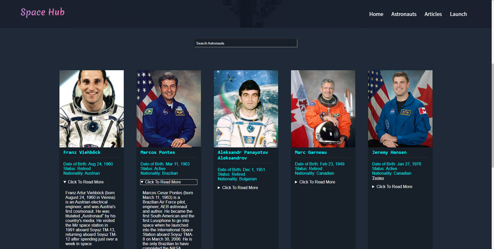
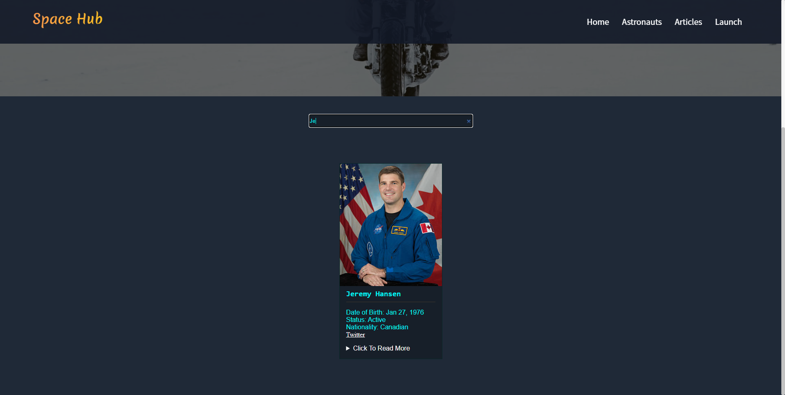
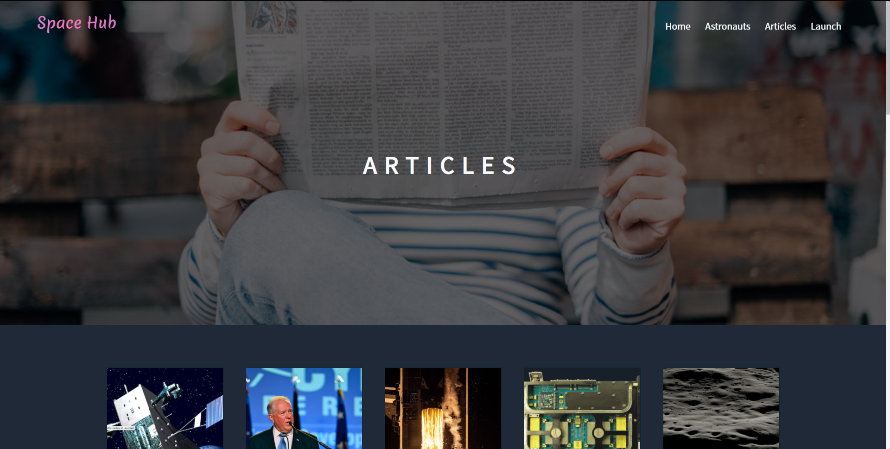
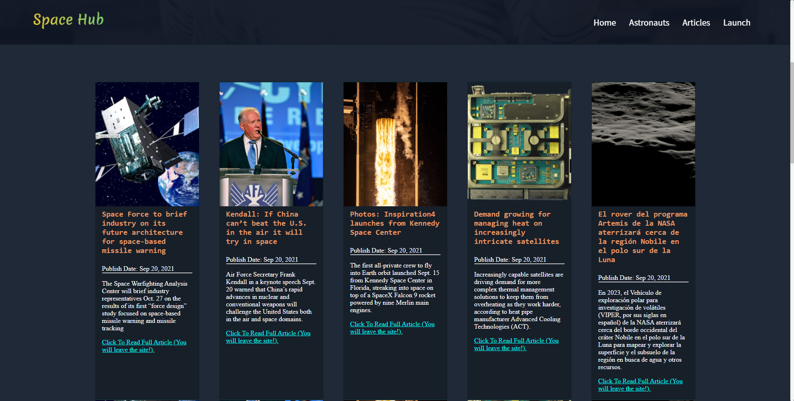

# About Us

**Hello, my name is Andre Willomitzer, and my partner in this project is Kevan Yang! We are students at Seneca College in Toronto, Canada. This project is a passion of ours and we decided to build it together to have a space website for news and learning about different astronauts. It is also nice to be able to share it with others who are also interested in seeing space imagery and learning about it.**
## Hosted At: https://space-hub-ca.netlify.app/
## SpaceHub UI

## To run the project

To run the project, download the source code and run npm install. Then, type ng serve --open in your command line.

